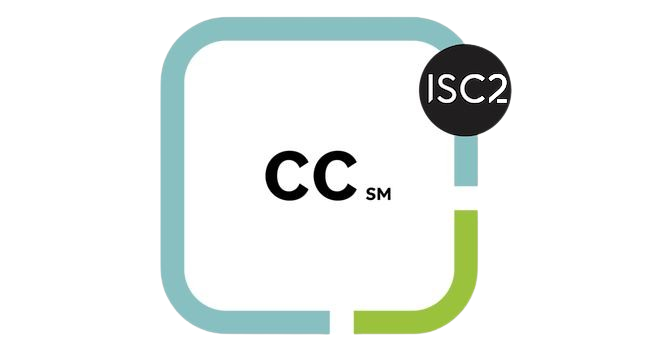

<h1 align="center">Hi, I'm Mishqat Abid</h1>
<h3 align="center">| Cyber Security Analyst | CTF Player | Red Teamer | Pentester |</h3>

---

## Certifications:

    
    
    
  
---

## Connect with me:

---

## Language and Tools

 
 
 
 
 
 
 
 
 
 
 
 
<a href="https://www.netacad.com/courses/packet-tracer" target="_blank" rel="noreferrer">  

---

## GitHub Stats:

---

- Reach me at:

 **mishqatabid@gmail.com**

---
